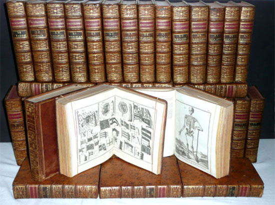

# La enciclopedia de Diderot y D'Alembert



```txt
LA ENCICLOPEDIA DE DIDEROT Y D’ALEMBERT
Encyclopédie de Diderot et d'Alembert.
Reprod. facs. de la ed. de: Paris : Chez Briasson, David, Le Breton, Durand, 1751-1777.
Parma, mIlán y París,Franco Maria Ricci, 1970.
BUS A Arm. 15/2/01-15.
```

___
## Wikipedia
- https://es.wikipedia.org/wiki/Encyclop%C3%A9die_ou_Dictionnaire_raisonn%C3%A9_des_sciences,_des_arts_et_des_m%C3%A9tiers
- https://en.wikipedia.org/wiki/Encyclop%C3%A9die

## Wikipedia Otros
- https://www.elconfidencial.com/cultura/2021-12-09/libros-raros-antiguos-primera-edicion-enciclopedia_3337675/
- https://archive.org/details/hombresbuenos0000prez/mode/2up
- https://www.bne.es/es/Micrositios/Guias/ObrasReferencia/Enciclopedias/EvolHistorica/EncicloFrancesa/
___


___
- 17 volumes of articles, issued from 1751 to 1765
- 11 volumes of illustrations, issued from 1762 to 1772
- 18,000 pages of text
- 75,000 entries

