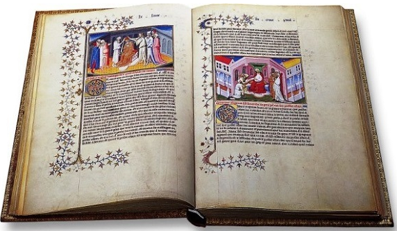

# El libro de las maravillas



```txt
EL LIBRO DE LAS MARAVILLAS
El Libro de Marco Polo.
Reprod. facs. de la ed. de Amberes, 1485, del ejemplar anotado por Cristóbal Colón y que se conserva en la Biblioteca Capitular y Colombina de Sevilla.
Madrid, Testimonio, 1986.
BUS A Arm. 12/030.
```
___
## Wikipedia
- https://es.wikipedia.org/wiki/Los_viajes_de_Marco_Polo
- https://en.wikipedia.org/wiki/The_Travels_of_Marco_Polo

### Wikimedia
- https://upload.wikimedia.org/wikipedia/commons/0/02/Libro_de_las_Maravillas_Livre_des_merveilles_Book_of_the_marvels_of_the_world_Fol_29v_Mythical_creatures.png

### Wikipedia Otros
- http://www.cubadebate.cu/libros-libres/2021/03/04/descargue-en-pdf-el-libro-de-marco-polo/
___
## Archive 
- https://gredos.usal.es/bitstream/handle/10366/122084/2006%20C%C1TEDRA%20GIL%20OLIVARI%20BATTAGLIA%20VALERO%20Libro%20de%20Marco%20Polo.pdf
- https://archive.org/details/ellibrodelasmaravillasmarcopolo_202003

___
## YouTube
- https://youtu.be/f0Nyn6vgsuo
