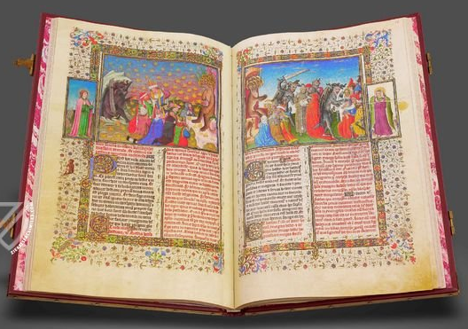

# El libro de las maravillas



```txt
EL LIBRO DE LAS MARAVILLAS
El Libro de Marco Polo.
Reprod. facs. de la ed. de Amberes, 1485, del ejemplar anotado por Cristóbal Colón y que se conserva en la Biblioteca Capitular y Colombina de Sevilla.
Madrid, Testimonio, 1986.
BUS A Arm. 12/030.
```
___
## Wikipedia
- es (no)
- en (no) Apocalypse of the Dukes of Savoy

### Wikimedia
- https://commons.wikimedia.org/wiki/File:Apocalypse_figur%C3%A9e_des_ducs_de_Savoie_-_Escorial_E_Vit.5_-_Folio_49v._La_Jerusal%C3%A9n_Celestial_(Jean_Colombe)_crop.jpg
- 

## Wikipedia Otros
- https://en.wikipedia.org/wiki/Duchy_of_Savoy
- 
___
## Archive 

___
## YouTube

- https://mobile.twitter.com/patrimnacional/status/1385504261652484097
- https://www.youtube.com/watch?v=v1oeW2oGg0Q
- https://www.youtube.com/watch?v=6dSm_tUwdV4&ab_channel=PatrimonioNacional
- 
