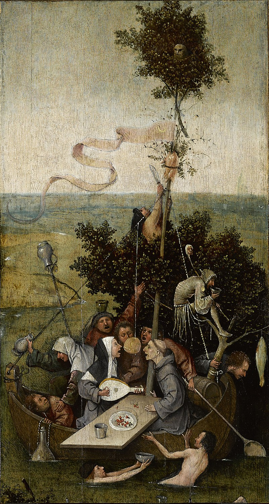

# La Nave De Los Locos



```txt
LA NAVE DE LOS LOCOS
Stultiferae naves / [Jodocus Badius Ascensius].
Reprod. facs. de la ed. impresa en Burgos, por Fadrique Biel de Basilea, no antes del 18 de Febrero de 1500.
Valencia, Vicent García y Biblioteca Nacional, 1998.
BUS A Arm. 14/3/04.
```
___
## Wikipedia
- https://es.wikipedia.org/wiki/La_nave_de_los_locos

___
### Wikimedia
- 

___
## Archive 
- 

___
## YouTube
- 