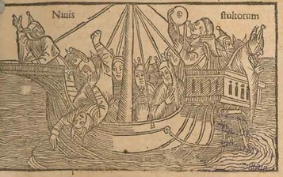

# La Nave De Los Locos



```txt
LA NAVE DE LOS LOCOS
Stultiferae naves / [Jodocus Badius Ascensius].
Reprod. facs. de la ed. impresa en Burgos, por Fadrique Biel de Basilea, no antes del 18 de Febrero de 1500.
Valencia, Vicent García y Biblioteca Nacional, 1998.
BUS A Arm. 14/3/04.
```
___
En 1494, Sebastian Brandt dio a la imprenta el que se había de convertir en uno de los bestsellers más extraordinarios, Das Narrenschiff (La nave de los locos). Traducida a casi todas las lenguas europeas, fue espejo inmisericorde de los vicios y defectos de su tiempo. 

___
## Wikipedia
- https://es.wikipedia.org/wiki/La_nave_de_los_necios
- https://en.wikipedia.org/wiki/Ship_of_Fools_(satire)

___
### Wikimedia

### Wikipedia Otros
- https://es.wikipedia.org/wiki/La_nave_de_los_locos
- https://es.wikipedia.org/wiki/Josse_Bade

___
## Archive 
- https://archive.org/details/sucho-id-00000679-irbis-incunabula-das-narrenschiff/page/n31/mode/2up
- 

___
## YouTube
- 