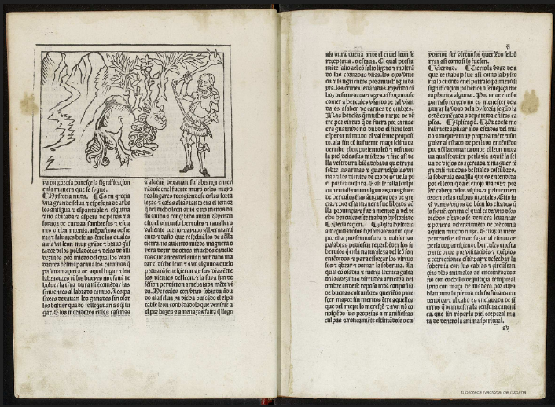

# Los Trabajos de Hércules



```txt
LOS TRABAJOS DE HÉRCULES
Los doze trabajos de Hércules, por Enrique de Aragón, Marqués de Villena.
Reprod. facs. de la ed. de Zamora, Antón de Centenera, 1483.
Valencia, Vicent García, 1995.
BUS A Arm. 13/3/19.
```
___
## Wikipedia


### Wikimedia
- https://es.wikipedia.org/wiki/Los_doce_trabajos_de_Heracles#/media/Archivo:Twelve_Labours_Altemps_Inv8642.jpg

### Wikipedia otros
- https://es.wikipedia.org/wiki/Los_doce_trabajos_de_Heracles
  
- https://es.wikipedia.org/wiki/Enrique_de_Villena#Su_obra

> Los doce trabajos de Hércules (1417), que escribió en valenciano y luego tradujo al castellano.​ El libro se compone de una Carta (en la que cuenta el origen del tratado), un Prohemio (en el que da la estructura e intencionalidad del libro) y doce capítulos, cada uno de ellos dividido en cuatro partes: Historia nuda (cuenta el trabajo de Hércules tal y como lo narran los antiguos), Declaraçión (interpreta moralmente la historia), Verdad (explica la narración desde un punto de vista histórico o, al menos, lógico) y Aplicaçión (adjudica el trabajo a un estado social y deduce unos modelos de comportamiento).

___
### Wikimedia
- https://commons.wikimedia.org/wiki/File:Los_doce_trabajos_de_H%C3%A9rcules_1499_Enrique_de_Villena.jpg

___
## Archive 
- https://archive.org/details/A335137

___
## YouTube
- https://www.youtube.com/watch?v=A2_j_r3qK6Y