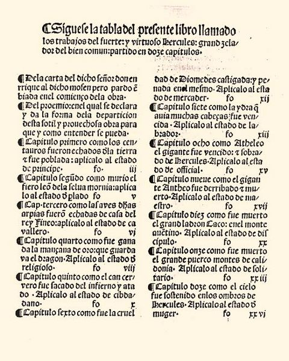

# Los Trabajos de Hércules



```txt
LOS TRABAJOS DE HÉRCULES
Los doze trabajos de Hércules, por Enrique de Aragón, Marqués de Villena.
Reprod. facs. de la ed. de Zamora, Antón de Centenera, 1483.
Valencia, Vicent García, 1995.
BUS A Arm. 13/3/19.
```
___
## Wikipedia otros
- https://es.wikipedia.org/wiki/Enrique_de_Villena#Su_obra

___
### Wikimedia
- https://commons.wikimedia.org/wiki/File:Los_doce_trabajos_de_H%C3%A9rcules_1499_Enrique_de_Villena.jpg

___
## Archive 
- https://archive.org/details/A335137

___
## YouTube
- https://www.youtube.com/watch?v=A2_j_r3qK6Y